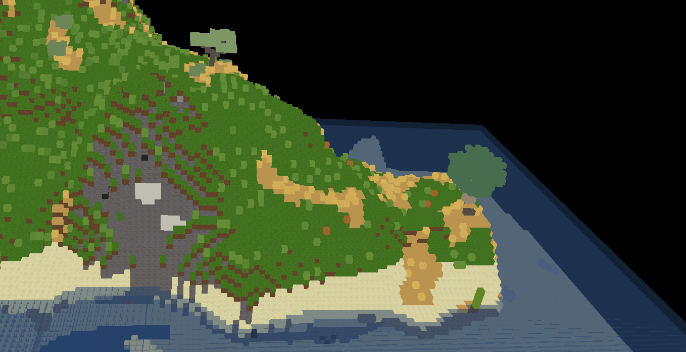

Minetest world view
=======

3D Web-World view, shows the map as a 3D-rendering in the browser

State: **WIP**





## Dependencies

* go 1.13+

## Running

```bash
go generate
go run .
```

Visit: http://127.0.0.1:8080

# Licence

:man_shrugging:
